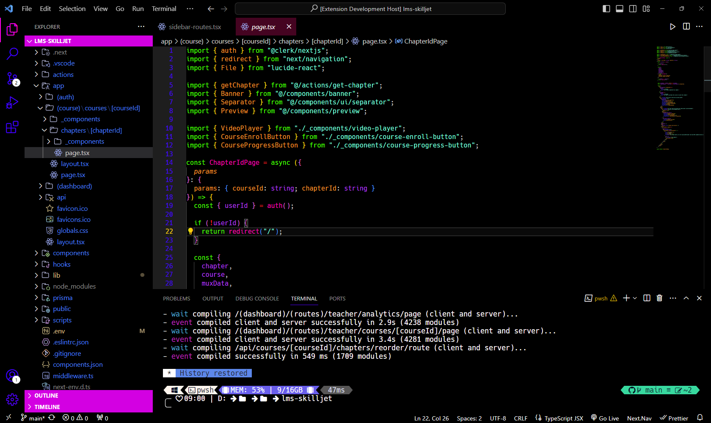
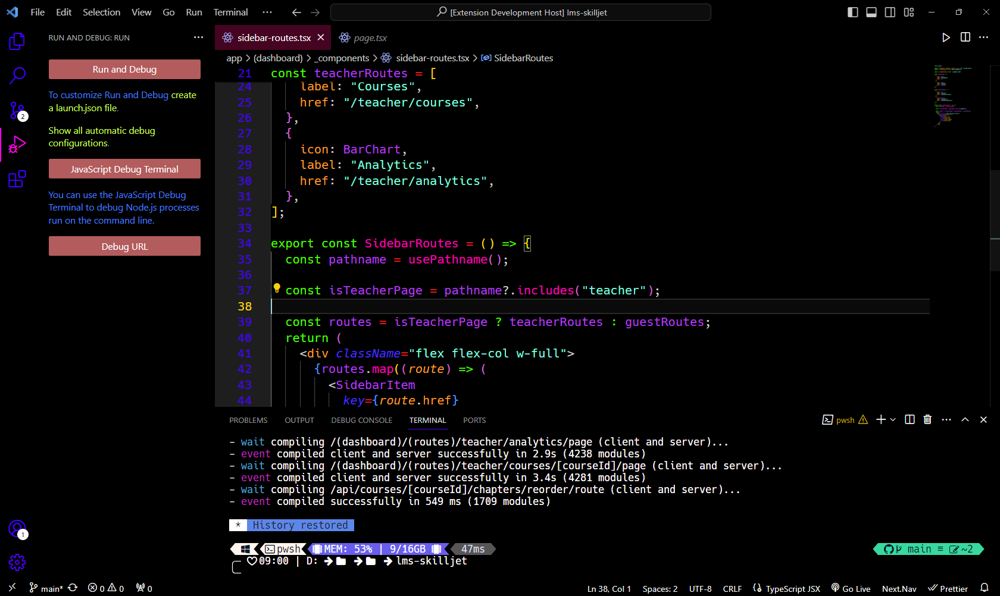

# Raneema Theme v1

Elevate your coding experience with **Raneema Theme v1**, a meticulously crafted Visual Studio Code theme designed for developers who appreciate a perfect blend of aesthetics and functionality.

## Screenshots

## Key Features

🎨 **Distinctive Color Palette:** Raneema Theme v1 introduces a carefully curated color palette that enhances code readability and reduces eye strain, allowing you to focus on what matters most—writing flawless code.

🚀 **Optimized for Productivity:** Boost your productivity with a thoughtfully designed syntax highlighting that emphasizes important code elements, making your codebase more accessible and intuitive.

🌈 **Customizable Accent Colors:** Tailor your coding environment to your liking with customizable accent colors. Make Raneema Theme v1 truly yours by selecting from a variety of accent options that suit your style.

🌟 **Sleek and Minimalistic Design:** Enjoy a clutter-free and distraction-free coding experience. Raneema Theme v1 features a sleek and minimalistic design, providing a clean canvas for your creative coding endeavors.

🔗 **Seamless Integration:** Whether you're working on a web development project, diving into data science, or coding in your favorite language, Raneema Theme v1 seamlessly integrates with various file types and languages for a cohesive coding experience.

## Installation

1. Open Visual Studio Code
2. Go to Extensions (Ctrl+Shift+X)
3. Search for "Raneema Theme v1"
4. Click Install
5. Select the theme from the Color Theme dropdown menu in the Command Palette (Ctrl+Shift+P)

Give your coding environment a fresh new look with **Raneema Theme v1**. Experience coding in style and boost your productivity. Happy coding!

## Attribution

Theme created by [Karots77](https://github.com/Adhnan23)
